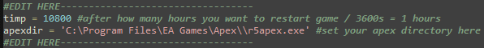

# Apex AFK Farm Bot

Based on [apexAFKfarmbot](https://github.com/iIndrasura/apexAFKfarmbot)

The Apex AFK Farm Bot is a powerful automation tool designed to assist Apex Legends players in farming in-game rewards while being AFK (Away From Keyboard). This repository provides the source code and instructions for using the bot effectively.
This script automates certain actions in the game using Python libraries such as pyautogui, keyboard, and PyScreeze. It simulates human behavior by interacting with the game interface based on screen recognition.

## SETTING UP
To setup, edit these lines with your desired automatic time for restart and apex directory
Open ApexFarmer.py with any text editor and edit those fields

## FEATURES
WORKS WITH SEASON 19 - ONLY 1920x1080 16:9
- starting the game automatically
- auto restart game on set interval (default = 10800)
- WHY: on low performance systems sometimes due to low memory game would freeze randomly after some hours
With this automatic restart it runs 12+ hours tested
- anti-kick
- auto start matchmaking
- getting out of news, battlepass windows etc.

## Installation
- WINDOWS installation
    1. Download executable from release
    2. Run the executable, on first run it will generate a config.ini file which you need to edit with your Apex directory and time for restart
    3. Follow the on screen instructions

## Contributing
Contributions are welcome! If you have any suggestions, bug fixes, or new features to add, feel free to open an issue or submit a pull request.

**Disclaimer: The usage of this script is at your own risk, and the developer takes no responsibility for any consequences resulting from its use.**
